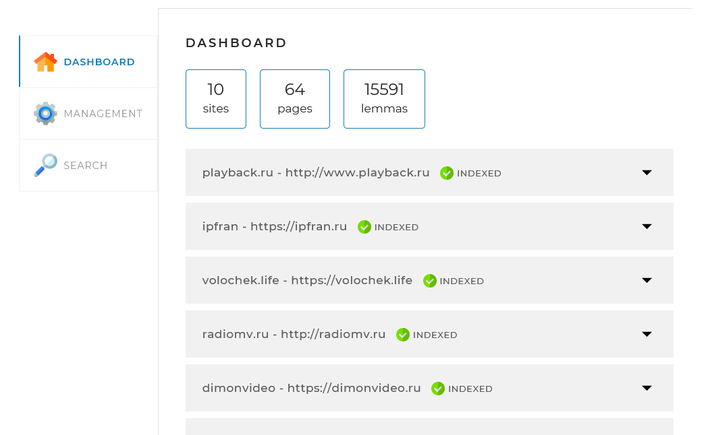
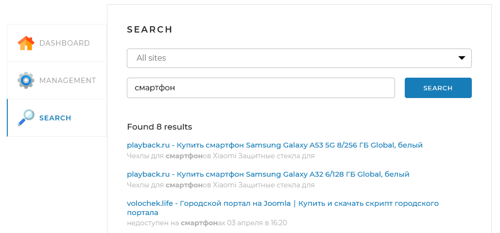

# SearchEngineJava

## Description
This application gives ability to index websites and search text on this sites

Website example: http://search-engine-java.scouser122.ru 

## About project
### Used technologies and settings
Backend of Search engine implemented with Spring Boot API

MySQL used to store website data

Frontend implemented with HTML, JS and CSS

All project settings in <a href="./application.yml">application.yml</a> file

### Application description
Search Engine webpage contains 3 parts:
1. Dashboard - displays info about indexed websites
2. Management - allows to start/stop indexing, or index separate webpages
3. Search - displays search results as webpages list

### Dependencies

To successfully download and connect to the dependency project from GitHub, you need to configure the Maven configuration in the settings.xml file

Since GitHub requires token authorization to get data from the public repository, to specify the token, find the settings.xml file.
- On Windows, it is located in the C:/Users/\<your username>/.m2 directory
- On Linux, the /home/\<your username>/.m2 directory
- On macOS at /Users/\<your username>/.m2

and add configuration text inside settings tag:

      <servers>
          <server>
              <id>github</id>
              <configuration>
                  <httpHeaders>
                      <property>
                          <name>Authorization</name>
                          <value>ACCESS TOKEN</value>
                      </property>
                  </httpHeaders>
              </configuration>
          </server>
      </servers>

Don't forget to change access token on actual one!

If file absent, create settings.xml with next content:

      <settings xmlns="http://maven.apache.org/SETTINGS/1.0.0"
      xmlns:xsi="http://www.w3.org/2001/XMLSchema-instance"
      xsi:schemaLocation="http://maven.apache.org/SETTINGS/1.0.0
      https://maven.apache.org/xsd/settings-1.0.0.xsd">

       <servers>
           <server>
               <id>github</id>
               <configuration>
                   <httpHeaders>
                       <property>
                           <name>Authorization</name>
                           <value>ACCESS TOKEN</value>
                       </property>
                   </httpHeaders>
               </configuration>
           </server>
       </servers>
      
      </settings>

Don't forget to change access token on actual one!

After that, in the project, update the dependencies (Ctrl+Shift+O / ⌘⇧I) or force update the data from pom.xml.

## Project setup
1. Setup JRE version 11 or later
2. Edit <a href="./application.yml">application.yml</a> file - set list of websites to scan in **sites** array
3. Edit <a href="./src/main/resources/templates/index.html">index.html</a> file - set your backend address in backendApiUrl variable
4. Setup MySQL database:
   1. Add new schema named **search_engine**
   2. Add new user with name and password as **spring.datasource.username** and **spring.datasource.password** settings in application.yml file
   3. Give this user permission to modify **search_engine** schema
5. Compile project to JAR file using IntelliJ IDEA Maven build tools
6. Copy <a href="./application.yml">application.yml</a> to same directory where JAR file will be placed
7. Run application with java, example: `java -jar SearchEngine-1.0.0.jar`

